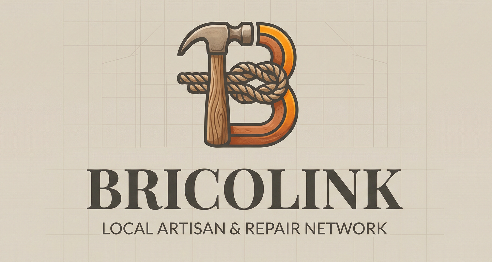

  

  <h1>BricoLink: Artisan Service Platform</h1>
  
Connecting communities with trusted local artisans for reliable craftsmanship and home services.

## 🏢 Organization Repositories

This organization contains the core components of the BricoLink university platform:

### 1. 🖥️ [bricolink-laravel](https://github.com/bricolink-project-tmp/bricolink-laravel)
The core backend REST API and the authentic frontend Web Views.
* **Tech Stack**: Laravel (PHP), Blade Templates, Tailwind CSS (Vite built).
* **Purpose**: Serves as the central backend logic, routing, and responsive browser-based interface for the community to book services.

### 2. 🗄️ Database Foundation (MySQL)
**Notice: We have officially transitioned away from Oracle Database.**
* **Tech Stack**: MySQL Database.
* **Purpose**: After evaluating local environment setup complexities, we have completely abandoned the `artisan-db-oracle` repository in favor of a standard, robust MySQL architecture. The relational data structure for Users, Artisans, and Bookings is now fully managed via Laravel's native migrations.

### 3. 📚 [bricolink-docs](https://github.com/bricolink-project-tmp/bricolink-docs)
Centralized project guidelines and setup logic.
* **Purpose**: Contains our updated architecture details, MySQL environment prerequisites, Vite/Tailwind build instructions, and our strict Git workflow.

---

### 🚀 Upcoming Phases
- **📱 Mobile Application**: A Flutter/Dart mobile app (Phase 2) designed to directly consume the Laravel REST API endpoints for a seamless mobile booking experience.

 

  <i>A non-profit initiative developed by the BricoLink University Project Team.</i>

